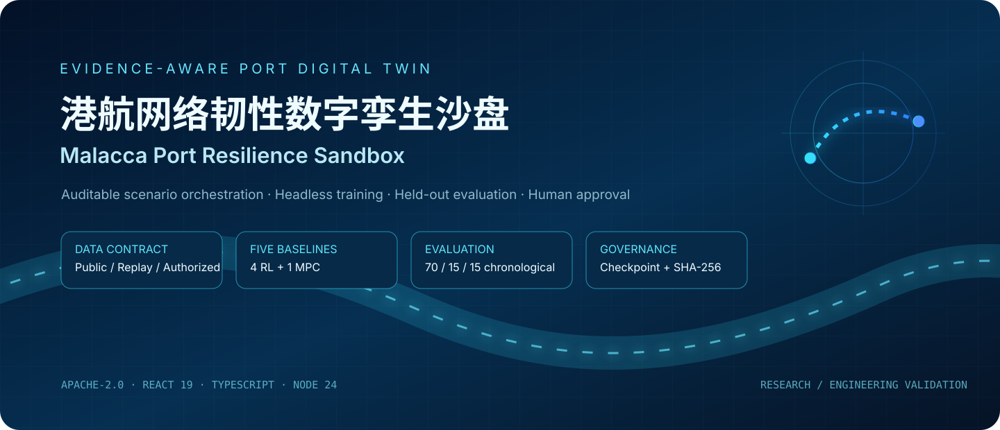
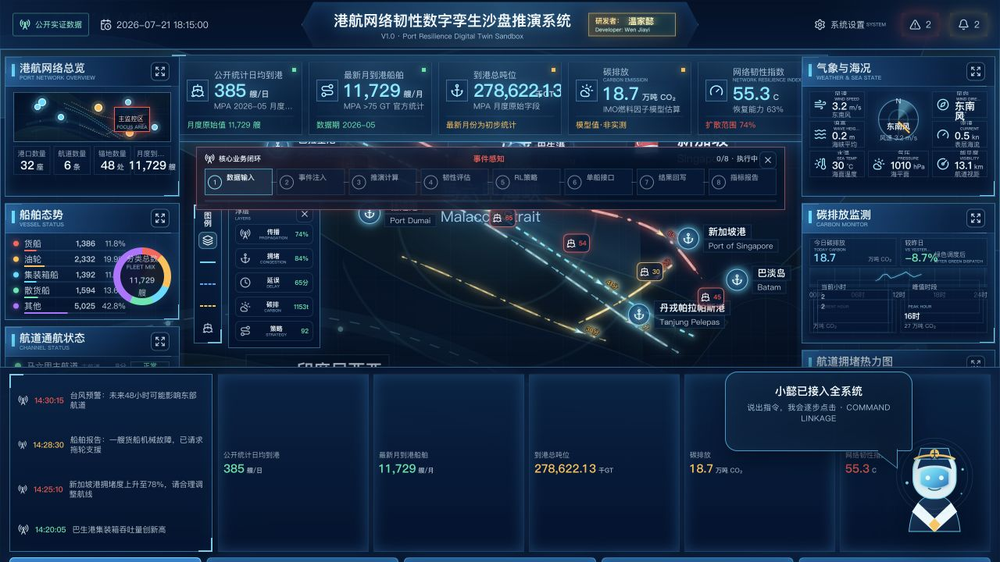
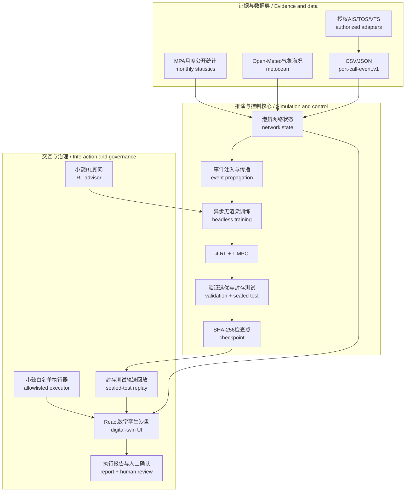
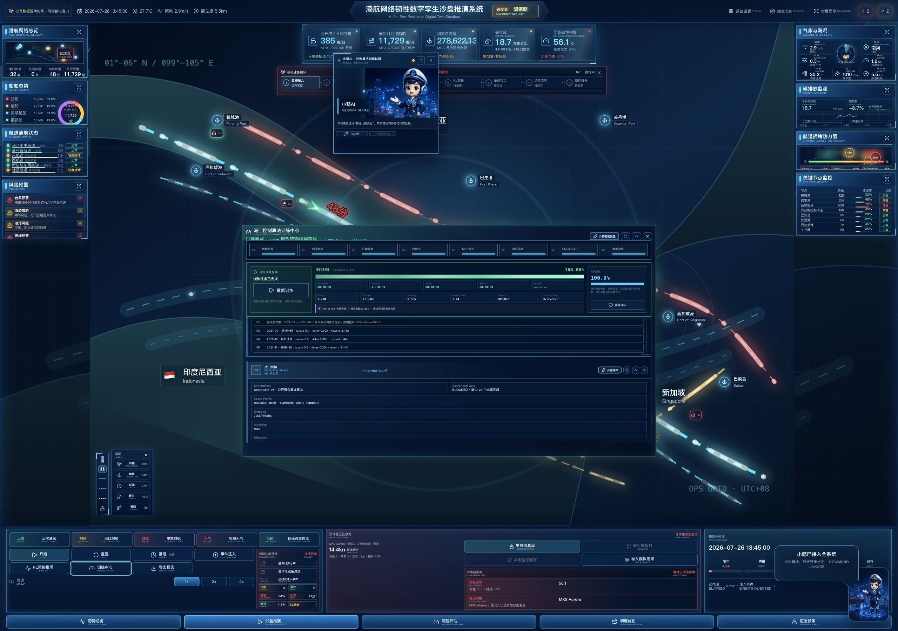
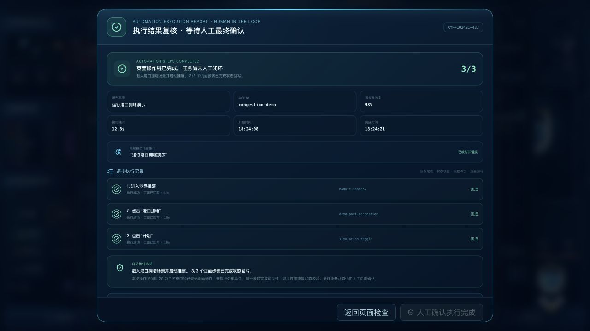

<p align="center">
  
</p>

<p align="center">
  <a href="#港航网络韧性数字孪生沙盘--malacca-port-resilience-sandbox">双语说明 / Bilingual guide</a> ·
  <a href="docs/SHANGHAI_PORT_LANDING.md">上海港接入 / Shanghai landing</a> ·
  <a href="docs/DATASET_CONTRACT.md">数据契约 / Data contract</a> ·
  <a href="docs/RL_ARCHITECTURE.md">算法架构 / RL architecture</a> ·
  <a href="docs/MODEL_CARD.md">模型卡 / Model card</a> ·
  <a href="SECURITY.md">安全策略 / Security</a>
</p>

<p align="center">
  <a href="https://github.com/wenjiayi123/malacca-port-resilience-sandbox/actions/workflows/ci.yml"></a>
  
  
  
  
  
</p>

<p align="center">
  <strong>研发作者：</strong>温家懿 · <strong>Research Author:</strong> Wen Jiayi
</p>

<table>
  <tr>
    <th align="center">长期需求证据<br /><sub>LONG-HORIZON DEMAND</sub></th>
    <th align="center">高频轨迹证据<br /><sub>HIGH-FREQUENCY AIS</sub></th>
    <th align="center">真实训练规模<br /><sub>TRAINING WORKLOAD</sub></th>
    <th align="center">保守压力诊断<br /><sub>CALIBRATED STRESS</sub></th>
    <th align="center">声明门禁<br /><sub>CLAIM GATE</sub></th>
  </tr>
  <tr>
    <td align="center"><strong>4,064,858</strong><br />累计到港艘次 / 377月</td>
    <td align="center"><strong>371,585</strong><br />AIS messages / 1,440 min</td>
    <td align="center"><strong>21,600</strong><br />RL episodes / 3×3 protocol</td>
    <td align="center"><strong>0.344h → 0.110h</strong><br />吞吐保持 99.715%</td>
    <td align="center"><strong>相对百分比禁用</strong><br />small-denominator blocked</td>
  </tr>
</table>

> **业务价值 / Business value：** 面向港航拥堵治理与韧性决策，项目以 MPA
> `Vessel Arrivals (>75 GT) and Shipping Tonnage` 与 Open-Meteo ERA5 构建
> **31 年、377 个月、统计口径累计 4,064,858 艘次**的长期需求证据，以 Zenodo/INFORE
> `10.5281/zenodo.3754481` 完成 **371,585 条原始 AIS 消息、1,440 个分钟窗口**的高频接入验证，
> 并对四种 RL 与三步 MPC 执行 **21,600 episodes** 的时序隔离评测。封存测试会阻止不稳定策略
> 被包装成收益；保守压力诊断只报告延误绝对减少 **14.0 分钟**、拥堵绝对减少
> **0.967 个百分点**及 **99.715% 吞吐保持**。`terminal-operations.v2` 进一步固化
> **37 项港口运行字段**与失败关闭门禁，为授权 TOS/VTS/AIS 数据替换接入真实港口提供边界。

<p align="center">
  <sub><strong>证据边界 / Evidence scope:</strong> 公开聚合数据驱动的离线模型回放；不是“韧性准确率”、VTS/TOS实测KPI或自动生产下发证明。</sub>
</p>

# 港航网络韧性数字孪生沙盘 / Malacca Port Resilience Sandbox

面向港口群、关键航道与船舶流的<strong>证据感知型数字孪生研究栈</strong>。项目把宏观沙盘推演、受控事件
编排、公开数据网关、可替换港口数据契约、五基线控制实验、严格时间留出评估、可恢复检查点与
人工审批闭环放进同一套 React + TypeScript + Node 系统。

An <strong>evidence-aware digital-twin research stack</strong> for port clusters, critical waterways, and vessel flows. It unifies macro network simulation, controlled-event orchestration, public-data gateways, replaceable port-data contracts, five-method control experiments, strict chronological holdout evaluation, recoverable checkpoints, and human approval in one React + TypeScript + Node system.

它不是一张只播放动画的大屏：训练进度来自服务器实际完成的 episode、环境步与参数更新；
训练阶段不渲染策略效果；只有任务完成后，显式评估接口才读取封存测试段并返回可回放 trace。

This is not an animation-only dashboard. Training progress comes from completed server-side episodes, environment steps, and parameter updates. Training does not render policy outcomes; only an explicit post-completion evaluation may read the sealed test segment and return a replayable trace.

> [!IMPORTANT]
> 本项目用于研究、教学和工程验证，不是 VTS/TOS、ECDIS、船舶导航设备或自动生产下发系统。
> 公开统计、模型估算、授权接口、历史回放和合成场景始终分开标识。
>
> This repository supports research, teaching, and engineering verification. It is not a VTS/TOS, ECDIS, navigation device, or autonomous production dispatcher. Public statistics, model estimates, authorized interfaces, historical replay, and synthetic scenarios remain explicitly separated.

<p align="center">
  
</p>

<p align="center">
  <sub><strong>港航态势与核心闭环：</strong>马六甲港航网络、拥堵传播、事件注入、策略回放与人工控制
  位于同一业务画面；公开统计、情景船舶和授权实时数据使用不同状态标识。<br />
  <strong>Maritime command loop:</strong> network state, congestion propagation, event injection,
  policy replay, and human control share one operational surface with explicit evidence modes.</sub>
</p>

## 为什么这个项目值得关注 / Why this project matters

- <strong>从态势到证据闭环</strong>：港口、航道、船舶、拥堵、延误、碳排与韧性状态共同进入事件推演，
  结果保留数据模式、时间、算法、检查点和人工确认信息。<br>
  *Ports, channels, vessels, congestion, delay, carbon, and resilience enter one event simulation, whose result retains data mode, time, algorithm, checkpoint, and human confirmation.*
- <strong>可审计的五基线实验</strong>：Q-Learning、SARSA、Expected SARSA、Dyna-Q 与 MPC 共享状态、动作、
  奖励、训练段和评估段；MPC 被明确标为控制理论基线，不伪装成 RL。<br>
  *Q-Learning, SARSA, Expected SARSA, Dyna-Q, and MPC share state, action, reward, training, and evaluation contracts; MPC is identified as control theory, not disguised as RL.*
- <strong>防止未来信息泄漏</strong>：默认 377 条 MPA 月度记录与 ERA5 风场按时间 70%/15%/15% 切分；容量代理只用训练段
  校准，验证前段调超参数、后段选算法，最终测试段保持封存。<br>
  *The 377 MPA monthly records and ERA5 forcing use a 70/15/15 temporal split. Capacity proxies fit on train only; the first validation segment tunes and the second selects; final test remains sealed.*
- <strong>训练与展示解耦</strong>：训练过程为 headless；测试完成后才由真实留出轨迹驱动地图回放。<br>
  *Training is headless; only completed holdout traces drive map replay.*
- <strong>受控的小懿联动</strong>：白名单界面执行器与 RL 参数顾问是两个独立层；自动步骤完成后生成执行
  报告，最终由人工确认或归档异常。<br>
  *The allowlisted Xiaoyi UI executor and RL advisor are separate layers. Automation produces an execution report, followed by human confirmation or exception archiving.*
- <strong>可替换港口而非写死港口</strong>：CSV/JSON 字段合同、港口选择、单位和质量规则独立于算法实现。<br>
  *CSV/JSON contracts, port selection, units, and quality rules are independent of algorithm code.*
- <strong>面向发布的工程边界</strong>：只读静态服务、Bearer 门禁、强 Token 校验、请求上限、限流、探针、
  结构化日志、SHA-256 检查点、容器非 root 运行与固定 SHA 的供应链工作流。<br>
  *Read-only static delivery, Bearer gates, strong-token checks, request bounds, rate limits, probes, structured logs, SHA-256 checkpoints, non-root containers, and SHA-pinned supply-chain workflows.*

## 固定韧性基准 / Pinned resilience benchmark

| 协议项 / Protocol | 固定设置 / Pinned setting |
|---|---|
| 数据 / Data | MPA月度到港统计 + ERA5风场，共377条，1995-01至2026-05<br><sub>377 MPA monthly-arrival + ERA5 forcing records, 1995-01 to 2026-05</sub> |
| 时间隔离 / Temporal isolation | 263 train / 57 validation / 57 sealed test，不随机打乱<br><sub>No randomized order</sub> |
| RL调参 / RL tuning | 每候选600 episodes、3组超参数、3个随机种子<br><sub>600 episodes per candidate, three parameter sets, three seeds</sub> |
| 方法 / Methods | Q-Learning、SARSA、Expected SARSA、Dyna-Q、三步MPC |
| 选型规则 / Selection | 验证前段调参、验证后段选型，最终测试不参与选择<br><sub>Tune on early validation, select on late validation; final test never selects</sub> |
| 保守动作上限 / Action envelope | 单步错峰≤2%、分流≤1%、短时能力增益≤2%<br><sub>Defer ≤2%, divert ≤1%, temporary capacity uplift ≤2%</sub> |
| 稳健性 / Robustness | 3个随机种子用于RL；确定性MPC改用3个连续封存时间块验证<br><sub>Three RL seeds; three chronological blocks for deterministic MPC</sub> |
| 声明门禁 / Claim gate | 绝对压力诊断8/8通过；相对下降百分比因小分母被禁止<br><sub>Absolute diagnostic 8/8; relative reduction claim blocked</sub> |

常态封存回放没有形成可测的基线延误或拥堵，MPC 在 96.49% 时段保持原计划，因此系统不制造
“常态收益”。在明确标注的温和压力诊断（到港 +5%、临时能力 −2%）中，三步 MPC 将代理延误从
0.344h 降至 0.110h、有效拥堵压力从 1.435% 降至 0.468%，同时保持 99.715% 吞吐、3.734%
逐步期望安全风险和 21.053% 非保持动作率。由于基线负担很小，相对变化会被放大到约 68%，
声明门禁明确禁止引用该百分比。完整五方法结果、绝对前后值、三时间块诊断和源码指纹见
[保守校准 v2 报告](reports/rl-benchmark-balanced-resilience-calibrated-v2.md)；原
[66% 报告](reports/rl-benchmark-balanced-resilience.md)仅作为校准前历史对照保留。

<p align="center">
  
</p>

<p align="center">
  <sub><strong>真实任务完成态：</strong>服务器任务返回 7,200 episodes、173,348 环境步、
  389,032 次参数更新、263/57/57 时间切分和 <code>checkpoint.json</code>；训练阶段不渲染策略效果，
  最终测试仍需显式启动。<br />
  <strong>Completed backend job:</strong> the server reports episodes, environment steps, updates,
  temporal isolation, and a checkpoint artifact; sealed-test replay remains explicit.</sub>
</p>

The normal sealed replay has no measurable baseline burden, so MPC holds plan for 96.49% of steps and
no normal-operation benefit is claimed. Under the explicitly bounded +5% arrival / −2% capacity stress
diagnostic, MPC changes proxy delay from 0.344h to 0.110h and effective congestion pressure from 1.435%
to 0.468%, with 99.715% throughput retention, 3.734% expected stepwise safety risk, and a 21.053%
non-hold action rate. The resulting relative percentage is blocked because the baseline denominator is
too small. See the [calibrated v2 evidence](reports/rl-benchmark-balanced-resilience-calibrated-v2.md);
the [legacy 66% report](reports/rl-benchmark-balanced-resilience.md) remains available only for audit.

## 上海港落地合同与大数据外部验证 / Shanghai landing and scale validation

马六甲海峡始终是仓库的默认主场景、产品叙事和启动配置；上海只作为显式启用的可迁移接入样例，
不会改变项目主体。

项目新增 `terminal-operations.v2` 严格清单，覆盖港区/码头、泊位、堆场、岸桥、闸口、海铁与
水水中转、ETA、航道潮窗、引拖、气象海况、安全危险品、岸电燃料与跨港转移。上海场景可用
`VITE_PORT_SCENE_PROFILE=shanghai-international-port` 启动；未配置授权同源快照时保持失败关闭，
不会用新加坡公开遥测填充上海画面。完整字段映射、官方事实来源和接入步骤见
[上海港落地手册](docs/SHANGHAI_PORT_LANDING.md)。

The `terminal-operations.v2` manifest covers terminals, berths, yards, quay cranes, gates, rail/water
transfers, ETA, navigation/tidal windows, pilots, tugs, metocean conditions, safety/hazmat controls,
shore power, fuels, and inter-port transfer evidence. The Shanghai scene starts fail-closed until an
authorized same-origin snapshot and data manifest are configured. Malacca remains the default product
scene; Shanghai is an opt-in portability example only.

第二个公开基准处理了 **371,585 条** Piraeus 原始 AIS 消息，形成 **1,440 条**分钟级记录，并用
相同的 Q-Learning、SARSA、Expected SARSA、Dyna-Q 与 MPC 做三随机种子时间留出比较。该数据只
覆盖 24 小时且没有实测泊位能力、GT、天气、安全和动作结果，因此作为高频接入/训练规模证据，
不替代 31 年 MPA 官方月报主证据，也不支持上海现场收益声明。来源、许可、负向结果和选择结论
保存在[公开数据可信度比较](reports/public-dataset-credibility-comparison.md)。

The second public benchmark processes **371,585 raw Piraeus AIS messages** into **1,440 minute-level
records** and runs the same five methods with three seeds and chronological holdout. Its 24-hour
coverage makes it scale evidence, not a Shanghai field KPI or a replacement for the long-horizon MPA
benchmark.

## 工程证据索引 / Engineering evidence index

| 画面 / Surface | 可见工程能力 / Visible engineering capability | 证据锚点 / Evidence anchor |
|---|---|---|
| 多层 UI + 小懿联动 | 沙盘、训练矩阵、参数顾问、白名单动作执行器 | [`XiaoyiSystemAssistant.tsx`](src/components/XiaoyiSystemAssistant.tsx)、[`xiaoyiRlAdvisorAdapter.ts`](src/integrations/xiaoyiRlAdvisorAdapter.ts) |
| 训练完成遥测 | episode、环境步、更新数、时间切分、Checkpoint | [`rlTrainingJobs.ts`](server/rlTrainingJobs.ts)、[`rlTrainingEngine.ts`](server/rlTrainingEngine.ts) |
| 核心闭环与人工门禁 | 事件传播、策略回放、执行报告、最终人工确认 | [`public_evidence_rl_operation.md`](docs/public_evidence_rl_operation.md)、[`MODEL_CARD.md`](docs/MODEL_CARD.md) |

## 架构 / Architecture



<p align="center">
  
</p>

<p align="center">
  <sub><strong>小懿多层 UI 联动完整截图：</strong>主沙盘、五方法训练矩阵、小懿 RL 参数顾问与白名单页面执行器
  同屏工作；原版小懿形象保持不变，训练结论仍以服务器任务、检查点和版本化报告为准。<br />
  <strong>Xiaoyi multi-surface linkage:</strong> the sandbox, five-method matrix, RL advisor, and
  allowlisted executor operate together while evidence remains anchored to backend artifacts.</sub>
</p>

## 五种统一基线 / Five comparable methods

| 方法 / Method | 分类 / Class | 仓库内实际行为 / Actual behavior | 可审计遥测 / Auditable telemetry |
|---|---|---|---|
| Q-Learning | RL | 离策略 Bellman 最优价值更新<br><sub>Off-policy Bellman optimal-value update</sub> | episode、环境步、参数更新、Q表<br><sub>episodes, steps, updates, Q table</sub> |
| SARSA | RL | 在策略下一动作价值更新<br><sub>On-policy next-action value update</sub> | episode、环境步、参数更新、Q表<br><sub>episodes, steps, updates, Q table</sub> |
| Expected SARSA | RL | 探索策略下的期望价值更新<br><sub>Expected value under the exploration policy</sub> | episode、环境步、参数更新、Q表<br><sub>episodes, steps, updates, Q table</sub> |
| Dyna-Q | RL | 真实交互更新与已学习转移模型规划回放<br><sub>Real interaction plus learned-model planning replay</sub> | 环境步、真实更新、规划更新、Q表<br><sub>steps, real/planning updates, Q table</sub> |
| MPC | 控制理论 / control theory | 训练段需求模型辨识与三步滚动时域枚举<br><sub>Train-only demand identification and three-step receding-horizon enumeration</sub> | 辨识误差、模型参数、控制动作<br><sub>identification error, model parameters, controls</sub> |

任务会运行/辨识全部五种方法。每种 RL 默认在验证前段比较 3 组超参数，验证后段选出的候选策略成为默认测试策略，但界面允许操作员在相同
最终测试段上切换其余方法进行可比评估。仓库不声称已实现 PPO、SAC、MAPPO 或深度神经策略。

Each job trains or identifies all five methods. Every RL method compares three hyperparameter sets on early validation; the candidate selected on late validation becomes the default test policy, while the UI can evaluate other methods on the same final segment. The repository does not claim PPO, SAC, MAPPO, or a deep-neural policy.

奖励函数同时约束延误、拥堵、碳指数、安全、韧性和吞吐服务率。错峰需求进入递延积压并在后续
时段释放，分流、扩容和递延均有干预成本，避免通过“丢掉需求”制造接近 100% 的虚高改善。

The objective jointly constrains delay, congestion, carbon index, safety, resilience, and throughput service. Shifted demand becomes deferred backlog released in later periods; diversion, capacity expansion, and deferral all carry intervention cost, preventing near-100% “improvement” by silently dropping demand.

## 数据证据与替换合同 / Data evidence and replacement contract

默认离线快照包含新加坡海事及港务管理局发布的 <strong>Vessel Arrivals (>75 GT), Monthly</strong> 数据：

- 377 条 MPA 月度记录按月对齐 ERA5 海面网格高风暴露特征，时间范围 `1995-01` 至 `2026-05`；<br>
  *377 MPA monthly records aligned to ERA5 sea-grid high-wind exposure, from `1995-01` to `2026-05`.*
- 公开来源与提取信息记录在 [`data/rl/README.md`](data/rl/README.md)；<br>
  *Public provenance and extraction details are recorded in [`data/rl/README.md`](data/rl/README.md).*
- 适用于时序切分、数据适配、算法复现和接口验证；<br>
  *Suitable for temporal splits, adapter tests, algorithm reproduction, and interface verification.*
- 不足以证明泊位级、分钟级或实时调度效果。<br>
  *Insufficient to establish berth-level, minute-level, or real-time dispatch performance.*

运行时可读取 MPA/data.gov.sg 与 Open-Meteo；未配置授权 AIS 接口时，地图船位会明确标为场景代表
船，不冒充实时 AIS。替换其他港口数据只需设置：

At runtime, the system can read MPA/data.gov.sg and Open-Meteo. Without an authorized AIS interface, map vessels are explicitly labelled scenario representatives rather than live AIS. To replace the port dataset, set:

```bash
PORT_TRAINING_DATASET_PATH=/absolute/path/to/port_training.csv
PORT_TRAINING_PORT_ID=SGSIN
```

字段、单位、时区、缺失值和多港口选择规则见 [`docs/DATASET_CONTRACT.md`](docs/DATASET_CONTRACT.md)。<br>
See [`docs/DATASET_CONTRACT.md`](docs/DATASET_CONTRACT.md) for fields, units, time zones, missing values, and multi-port selection.

## 快速开始 / Quick start

要求 Node.js 24+。一键脚本会依次使用已安装的 pnpm、Corepack 或 npx，因此不要求全局安装
pnpm；缺少 `node_modules` 时会按锁文件自动安装依赖并打开浏览器。<br>
Requires Node.js 24+. The launcher uses an installed pnpm, Corepack, or npx in that order, so a global
pnpm installation is not required. It installs locked dependencies when needed and opens the browser.

```bash
bash scripts/demo/start_web_demo.sh
```

用于完整复现发布校验的命令：<br>
For a complete release-gate reproduction:

```bash
corepack pnpm install --frozen-lockfile
corepack pnpm release:check
```

一键脚本默认打开 <http://127.0.0.1:5180>。进入“沙盘推演”，打开“训练中心”，先完成训练，再运行训练后策略
测试或检查点推理。<br>
The launcher opens <http://127.0.0.1:5180>. Enter the sandbox, open the training centre, complete
training, and only then run post-training policy evaluation or checkpoint inference.

生产式本机运行使用独立 Node 服务：<br>
For a production-shaped local runtime, use the standalone Node service:

```bash
pnpm build
pnpm start
```

监听非回环地址时，系统会失败关闭，除非 `PORT_API_TOKEN` 是不少于 32 个字符的非占位随机密钥。<br>
Remote binding fails closed unless `PORT_API_TOKEN` is a non-placeholder random secret of at least 32 characters.

```bash
docker build -t malacca-port-sandbox .
export PORT_API_TOKEN="$(openssl rand -hex 32)"
docker run --rm -p 4173:4173 \
  -e PORT_API_TOKEN \
  -v malacca-rl:/app/runtime \
  malacca-port-sandbox
```

## API 面 / API surface

```text
GET    /healthz
GET    /readyz
GET    /api/openapi.json
GET    /api/public-data/snapshot
GET    /api/rl/datasets
GET    /api/rl/contracts/terminal-operations
GET    /api/rl/jobs
POST   /api/rl/jobs
GET    /api/rl/jobs/:jobId
DELETE /api/rl/jobs/:jobId
GET    /api/rl/jobs/:jobId/checkpoint
POST   /api/rl/jobs/:jobId/evaluate
POST   /api/rl/inference
POST   /api/port-calls/validate
POST   /api/xiaoyi/rl-advisor
```

OpenAPI 是接口发现入口；更严格的数据合同与互操作边界分别记录在
[`DATASET_CONTRACT.md`](docs/DATASET_CONTRACT.md) 和
[`PORT_CALL_INTEROPERABILITY.md`](docs/PORT_CALL_INTEROPERABILITY.md)。字段对齐不代表 DCSA、
IALA 或 IMO 合规认证。

OpenAPI is the interface-discovery entry. Stricter data and interoperability boundaries are documented in [`DATASET_CONTRACT.md`](docs/DATASET_CONTRACT.md) and [`PORT_CALL_INTEROPERABILITY.md`](docs/PORT_CALL_INTEROPERABILITY.md). Field alignment is not DCSA, IALA, or IMO compliance certification.

## 复现、发布与安全 / Reproduction, release, and security

```bash
pnpm lint          # ESLint + TypeScript规则 / rules
pnpm test          # 数据隔离、更新、恢复与安全 / isolation, updates, recovery, safety
pnpm benchmark:rl  # 3种子离线回放 / three-seed offline replay and evidence
pnpm benchmark:rl:verify # 数据/代码哈希与全算法指标 / hashes and full-method metrics
pnpm data:sync:infore-ais # 下载并校验公开AIS包 / fetch and verify public AIS package
pnpm benchmark:public-data # 公开大数据五方法比较 / large-public-data five-method comparison
pnpm benchmark:public-data:verify # 数据来源、许可与结果门禁 / provenance and result gate
pnpm build         # 严格类型检查与生产构建 / strict types and production build
pnpm release:check # 门禁、密钥、资产与工作流 / gates, secrets, assets, workflows
pnpm audit --audit-level=moderate
```

发布标签工作流会构建静态应用、生成 SPDX SBOM 和发布包；仓库公开后再执行 GitHub provenance
attestation、CodeQL 与 OSSF Scorecard。安全边界见 [`SECURITY.md`](SECURITY.md)，模型限制见
[`docs/MODEL_CARD.md`](docs/MODEL_CARD.md)。

Release-tag workflows build the static application, SPDX SBOM, and release bundle. GitHub provenance attestation, CodeQL, and OSSF Scorecard run after public release. See [`SECURITY.md`](SECURITY.md) for security boundaries and [`docs/MODEL_CARD.md`](docs/MODEL_CARD.md) for model limitations.

<p align="center">
  
</p>

<p align="center">
  <sub><strong>执行报告与人工门禁：</strong>小懿完成白名单步骤后生成可复核报告，异常可归档，
  最终策略应用仍由人工确认，不将界面联动等同于无人值守生产控制。<br />
  <strong>Human-governed execution:</strong> allowlisted steps produce a reviewable report;
  exceptions are archived and final application remains human-confirmed.</sub>
</p>

## 明确不包含 / Explicit exclusions

- 未提供港口生产账号、实时 AIS/TOS/VTS 数据或控制权限；<br>
  *No production port accounts, live AIS/TOS/VTS data, or control authority.*
- 未提供安全认证、调度 SLA、海上避碰认证或无人值守决策；<br>
  *No safety certification, dispatch SLA, collision-avoidance certification, or unattended decision authority.*
- 碳排、拥堵、延误和韧性指标包含模型估算，不等同于现场实测标签；<br>
  *Carbon, congestion, delay, and resilience include model estimates, not measured site labels.*
- `reports/` 会透明保存全部五种方法的留出结果及核心代码指纹，不能只挑单次最好结果冒充结论；<br>
  *`reports/` retains all five methods’ holdout results and core-code fingerprints; one best run cannot stand in for the conclusion.*
- Godot Web 二进制因体积与独立资产许可不进入源码仓库，仅保留接口与重建说明；<br>
  *Godot Web binaries are excluded because of size and separate asset licensing; contracts and rebuild instructions remain.*
- 外部小懿服务不可用时使用确定性规则顾问，并在界面明确显示，不伪装成大模型在线结果。<br>
  *When external Xiaoyi is unavailable, the UI explicitly identifies the deterministic rule advisor rather than presenting it as an online LLM.*

## 项目结构 / Repository map

```text
src/                         React沙盘、状态机、小懿与回放 / sandbox, state, Xiaoyi, replay
server/                      数据网关、训练、检查点与服务 / gateway, jobs, checkpoints, server
data/rl/                     MPA月度公开快照 / reproducible monthly public snapshot
tests/                       算法、隔离、恢复、合同与安全 / algorithms, isolation, recovery, contracts
reports/                     带证据等级的RL报告 / evidence-labelled offline RL reports
docs/                        模型卡、数据契约与审计 / model card, data, interoperability, audit
public/assets/               小懿原版形象与项目视觉资产 / canonical Xiaoyi and project visuals
.github/                     CI、安全与发布工作流 / CI, security, release workflows
```

## 贡献与引用 / Contributing and citation

贡献前请阅读 [`CONTRIBUTING.md`](CONTRIBUTING.md)、[`GOVERNANCE.md`](GOVERNANCE.md) 与
[`CODE_OF_CONDUCT.md`](CODE_OF_CONDUCT.md)。算法变更必须提供固定种子、数据指纹、切分说明、
实际更新遥测和可复现测试。学术或工程材料可使用 [`CITATION.cff`](CITATION.cff) 引用。

Read [`CONTRIBUTING.md`](CONTRIBUTING.md), [`GOVERNANCE.md`](GOVERNANCE.md), and [`CODE_OF_CONDUCT.md`](CODE_OF_CONDUCT.md) before contributing. Algorithm changes must provide pinned seeds, a data fingerprint, split semantics, actual update telemetry, and reproducible tests. Cite academic or engineering use through [`CITATION.cff`](CITATION.cff).

## 许可证 / License

代码与项目原创矢量资产使用 Apache-2.0；公开数据与运行时提供方仍保留各自条款，详见 [`NOTICE`](NOTICE) 与 [`docs/ASSET_PROVENANCE.md`](docs/ASSET_PROVENANCE.md)。<br>
Code and project-original vector assets are released under Apache-2.0. Public datasets and runtime providers retain their own terms; see [`NOTICE`](NOTICE) and [`docs/ASSET_PROVENANCE.md`](docs/ASSET_PROVENANCE.md).
