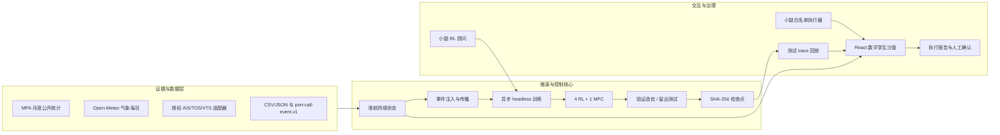

<p align="center">
  
</p>

<p align="center">
  <a href="#中文">中文</a> · <a href="#english">English</a> ·
  <a href="docs/DATASET_CONTRACT.md">数据契约</a> ·
  <a href="docs/RL_ARCHITECTURE.md">算法架构</a> ·
  <a href="docs/MODEL_CARD.md">模型卡</a> ·
  <a href="SECURITY.md">安全策略</a>
</p>

<p align="center">
  <a href="https://github.com/wenjiayi123/malacca-port-resilience-sandbox/actions/workflows/ci.yml"></a>
  
  
  
  
  
</p>

<table>
  <tr>
    <th align="center">公开月度记录<br /><sub>PUBLIC RECORDS</sub></th>
    <th align="center">统一策略矩阵<br /><sub>CONTROL MATRIX</sub></th>
    <th align="center">模型延误<br /><sub>MODEL DELAY</sub></th>
    <th align="center">模型拥堵<br /><sub>MODEL CONGESTION</sub></th>
    <th align="center">吞吐保持<br /><sub>THROUGHPUT RETENTION</sub></th>
  </tr>
  <tr>
    <td align="center"><strong>377</strong><br />MPA + ERA5</td>
    <td align="center"><strong>4 RL + MPC</strong><br />3 seeds / sealed test</td>
    <td align="center"><strong>−66.00%</strong><br />MPC vs hold-plan</td>
    <td align="center"><strong>−66.27%</strong><br />closed-loop replay</td>
    <td align="center"><strong>99.03%</strong><br />deferred backlog 4.97%</td>
  </tr>
</table>

<p align="center">
  <sub><strong>证据边界 / Evidence scope:</strong> 公开聚合数据驱动的离线模型回放；不是“韧性准确率”、VTS/TOS实测KPI或自动生产下发证明。</sub>
</p>

<a id="中文"></a>

# 港航网络韧性数字孪生沙盘

面向港口群、关键航道与船舶流的**证据感知型数字孪生研究栈**。项目把宏观沙盘推演、受控事件
编排、公开数据网关、可替换港口数据契约、五基线控制实验、严格时间留出评估、可恢复检查点与
人工审批闭环放进同一套 React + TypeScript + Node 系统。

它不是一张只播放动画的大屏：训练进度来自服务器实际完成的 episode、环境步与参数更新；
训练阶段不渲染策略效果；只有任务完成后，显式评估接口才读取封存测试段并返回可回放 trace。

> [!IMPORTANT]
> 本项目用于研究、教学和工程验证，不是 VTS/TOS、ECDIS、船舶导航设备或自动生产下发系统。
> 公开统计、模型估算、授权接口、历史回放和合成场景始终分开标识。

## 为什么这个项目值得关注

- **从态势到证据闭环**：港口、航道、船舶、拥堵、延误、碳排与韧性状态共同进入事件推演，
  结果保留数据模式、时间、算法、检查点和人工确认信息。
- **可审计的五基线实验**：Q-Learning、SARSA、Expected SARSA、Dyna-Q 与 MPC 共享状态、动作、
  奖励、训练段和评估段；MPC 被明确标为控制理论基线，不伪装成 RL。
- **防止未来信息泄漏**：默认 377 条 MPA 月度记录与 ERA5 风场按时间 70%/15%/15% 切分；容量代理只用训练段
  校准，验证前段调超参数、后段选算法，最终测试段保持封存。
- **训练与展示解耦**：训练过程为 headless；测试完成后才由真实留出轨迹驱动地图回放。
- **受控的小懿联动**：白名单界面执行器与 RL 参数顾问是两个独立层；自动步骤完成后生成执行
  报告，最终由人工确认或归档异常。
- **可替换港口而非写死港口**：CSV/JSON 字段合同、港口选择、单位和质量规则独立于算法实现。
- **面向发布的工程边界**：只读静态服务、Bearer 门禁、强 Token 校验、请求上限、限流、探针、
  结构化日志、SHA-256 检查点、容器非 root 运行与固定 SHA 的供应链工作流。

## 固定韧性基准 / Pinned resilience benchmark

| 协议项 / Protocol | 固定设置 / Pinned setting |
|---|---|
| 数据 / Data | MPA月度到港统计 + ERA5风场，共377条，1995-01至2026-05 |
| 时间隔离 / Temporal isolation | 263 train / 57 validation / 57 sealed test，不随机打乱 |
| RL调参 / RL tuning | 每候选600 episodes、3组超参数、3个随机种子 |
| 方法 / Methods | Q-Learning、SARSA、Expected SARSA、Dyna-Q、三步MPC |
| 选型规则 / Selection | 验证前段调参、验证后段选型，最终测试不参与选择 |
| 声明门禁 / Claim gate | 吞吐、期望安全风险、延误、拥堵、跨种子稳定性、递延积压6/6通过 |

验证选出的Expected SARSA在封存闭环回放中暴露出跨种子不稳定，系统因此不把它包装为业务收益；稳定的MPC对照在同一测试段实现模型延误降低66.00%、拥堵降低66.27%、吞吐保持99.03%、期望安全违规率3.67%，最终递延积压为平均月到港量的4.97%。完整五算法结果、负向结果和源码指纹均保存在[`reports/rl-benchmark-balanced-resilience.md`](reports/rl-benchmark-balanced-resilience.md)。

The validation-selected Expected SARSA policy becomes unstable across seeds on the sealed closed-loop replay and is therefore rejected as a resume benefit claim. The deterministic MPC comparator passes all six declared claim gates on the same test window. Full positive and negative results remain visible in the versioned report instead of being reduced to a cherry-picked headline.

## 系统画面

| 港航态势与核心闭环 | 小懿执行报告与人工门禁 |
|---|---|
|  |  |

## 架构



## 五种统一基线

| 方法 | 分类 | 仓库内实际行为 | 可审计遥测 |
|---|---|---|---|
| Q-Learning | RL | 离策略 Bellman 最优价值更新 | episode、环境步、参数更新、Q 表 |
| SARSA | RL | 在策略下一动作价值更新 | episode、环境步、参数更新、Q 表 |
| Expected SARSA | RL | 探索策略下的期望价值更新 | episode、环境步、参数更新、Q 表 |
| Dyna-Q | RL | 真实交互更新与已学习转移模型规划回放 | 环境步、真实更新、规划更新、Q 表 |
| MPC | 控制理论 | 训练段需求模型辨识与三步滚动时域枚举 | 辨识误差、模型参数、控制动作 |

任务会运行/辨识全部五种方法。每种 RL 默认在验证前段比较 3 组超参数，验证后段选出的候选策略成为默认测试策略，但界面允许操作员在相同
最终测试段上切换其余方法进行可比评估。仓库不声称已实现 PPO、SAC、MAPPO 或深度神经策略。

奖励函数同时约束延误、拥堵、碳指数、安全、韧性和吞吐服务率。错峰需求进入递延积压并在后续
时段释放，分流、扩容和递延均有干预成本，避免通过“丢掉需求”制造接近 100% 的虚高改善。

## 数据证据与替换合同

默认离线快照包含新加坡海事及港务管理局发布的 **Vessel Arrivals (>75 GT), Monthly** 数据：

- 377 条 MPA 月度记录按月对齐 ERA5 海面网格高风暴露特征，时间范围 `1995-01` 至 `2026-05`；
- 公开来源与提取信息记录在 [`data/rl/README.md`](data/rl/README.md)；
- 适用于时序切分、数据适配、算法复现和接口验证；
- 不足以证明泊位级、分钟级或实时调度效果。

运行时可读取 MPA/data.gov.sg 与 Open-Meteo；未配置授权 AIS 接口时，地图船位会明确标为场景代表
船，不冒充实时 AIS。替换其他港口数据只需设置：

```bash
PORT_TRAINING_DATASET_PATH=/absolute/path/to/port_training.csv
PORT_TRAINING_PORT_ID=SGSIN
```

字段、单位、时区、缺失值和多港口选择规则见 [`docs/DATASET_CONTRACT.md`](docs/DATASET_CONTRACT.md)。

## 快速开始

要求 Node.js 24+ 与 pnpm 11+。

```bash
corepack enable
pnpm install --frozen-lockfile
pnpm release:check
pnpm dev
```

打开 <http://127.0.0.1:5174>。进入“沙盘推演”，打开“训练中心”，先完成训练，再运行训练后策略
测试或检查点推理。

生产式本机运行使用独立 Node 服务：

```bash
pnpm build
pnpm start
```

监听非回环地址时，系统会失败关闭，除非 `PORT_API_TOKEN` 是不少于 32 个字符的非占位随机密钥。

```bash
docker build -t malacca-port-sandbox .
export PORT_API_TOKEN="$(openssl rand -hex 32)"
docker run --rm -p 4173:4173 \
  -e PORT_API_TOKEN \
  -v malacca-rl:/app/runtime \
  malacca-port-sandbox
```

## API 面

```text
GET    /healthz
GET    /readyz
GET    /api/openapi.json
GET    /api/public-data/snapshot
GET    /api/rl/datasets
GET    /api/rl/jobs
POST   /api/rl/jobs
GET    /api/rl/jobs/:jobId
DELETE /api/rl/jobs/:jobId
GET    /api/rl/jobs/:jobId/checkpoint
POST   /api/rl/jobs/:jobId/evaluate
POST   /api/rl/inference
POST   /api/port-calls/validate
POST   /api/xiaoyi/rl-advisor
```

OpenAPI 是接口发现入口；更严格的数据合同与互操作边界分别记录在
[`DATASET_CONTRACT.md`](docs/DATASET_CONTRACT.md) 和
[`PORT_CALL_INTEROPERABILITY.md`](docs/PORT_CALL_INTEROPERABILITY.md)。字段对齐不代表 DCSA、
IALA 或 IMO 合规认证。

## 复现、发布与安全

```bash
pnpm lint          # ESLint + TypeScript rules
pnpm test          # 数据隔离、算法更新、检查点恢复、合同与运行安全
pnpm benchmark:rl  # 3 种子离线模型回放，输出 reports/ 中的简历指标证据
pnpm benchmark:rl:verify # 复核数据/核心代码 SHA-256 与全算法指标完整性
pnpm build         # 严格类型检查 + Vite 生产构建
pnpm release:check # 完整门禁、密钥扫描、资产与工作流检查
pnpm audit --audit-level=moderate
```

发布标签工作流会构建静态应用、生成 SPDX SBOM 和发布包；仓库公开后再执行 GitHub provenance
attestation、CodeQL 与 OSSF Scorecard。安全边界见 [`SECURITY.md`](SECURITY.md)，模型限制见
[`docs/MODEL_CARD.md`](docs/MODEL_CARD.md)。

## 明确不包含

- 未提供港口生产账号、实时 AIS/TOS/VTS 数据或控制权限；
- 未提供安全认证、调度 SLA、海上避碰认证或无人值守决策；
- 碳排、拥堵、延误和韧性指标包含模型估算，不等同于现场实测标签；
- `reports/` 会透明保存全部五种方法的留出结果及核心代码指纹，不能只挑单次最好结果冒充结论；
- Godot Web 二进制因体积与独立资产许可不进入源码仓库，仅保留接口与重建说明；
- 外部小懿服务不可用时使用确定性规则顾问，并在界面明确显示，不伪装成大模型在线结果。

## 项目结构

```text
src/                         React 沙盘、状态机、小懿受控交互与回放 UI
server/                      公共数据网关、训练任务、检查点与生产服务
data/rl/                     可复现的 MPA 月度公开快照
tests/                       算法、隔离、恢复、合同和运行安全测试
reports/                     明确标注证据等级的离线 RL 指标报告
docs/                        模型卡、数据契约、互操作与开源审计
public/assets/               项目原创 SVG 运行资产
.github/                     CI、安全扫描、依赖与发布工作流
```

## 贡献与引用

贡献前请阅读 [`CONTRIBUTING.md`](CONTRIBUTING.md)、[`GOVERNANCE.md`](GOVERNANCE.md) 与
[`CODE_OF_CONDUCT.md`](CODE_OF_CONDUCT.md)。算法变更必须提供固定种子、数据指纹、切分说明、
实际更新遥测和可复现测试。学术或工程材料可使用 [`CITATION.cff`](CITATION.cff) 引用。

---

<a id="english"></a>

# English

## Malacca Port Resilience Sandbox

An **evidence-aware port digital-twin research stack** for port clusters, critical waterways and vessel flows.
It combines scenario orchestration, replaceable data contracts, asynchronous headless control experiments,
chronological holdout evaluation, recoverable checkpoints, trace-driven replay and human approval in one
React + TypeScript + Node application.

This is not a presentation-only dashboard. Training telemetry comes from completed environment steps and
parameter updates. The training phase produces no policy-rendering frames; the sealed test split is read only
after an explicit evaluation request.

> [!WARNING]
> This repository is for research, education and engineering validation. It is not a VTS/TOS replacement,
> navigation device, certified collision-avoidance system or autonomous production dispatcher.

### Core capabilities

- A macro maritime network sandbox covering ports, channels, representative vessels, congestion, delay,
  carbon estimates, risk propagation and resilience recovery.
- Four tabular RL implementations—Q-Learning, SARSA, Expected SARSA and Dyna-Q—plus one clearly classified
  MPC control baseline under a shared state/action/reward contract.
- Chronological `70/15/15` train/validation/final-test isolation over a reproducible 377-row MPA monthly sample.
- Train-only capacity-proxy calibration plus validation-tuning/validation-selection isolation for RL hyperparameters.
- Asynchronous jobs, real progress telemetry, atomic checkpoints, SHA-256 integrity and process-restart recovery.
- An explicit post-training evaluation endpoint that returns held-out traces for UI replay.
- A controlled Xiaoyi UI executor and a separate RL configuration advisor, followed by a detailed execution
  report and final human acknowledgement.
- Public-data, authorized-adapter, replay, model-estimate and synthetic modes that remain visibly distinct.
- A hardened single-instance reference server with fail-closed remote binding, strong-token validation,
  bounded requests, rate limiting, health/readiness probes and structured logs.

### Reproduce locally

```bash
corepack enable
pnpm install --frozen-lockfile
pnpm release:check
pnpm dev
```

Open <http://127.0.0.1:5174>. For the standalone reference server, run `pnpm build && pnpm start`.

### Production boundary

The bundled MPA sample is monthly aggregate evidence. It is suitable for reproducibility and adapter testing,
not berth-level operational validation. A real deployment still requires authorized high-frequency data,
identity and access management, site-specific safety rules, audit retention, model approval, rollback and
accountable human ownership. The built-in inference API never constitutes permission to actuate port or vessel
equipment.

See the [dataset contract](docs/DATASET_CONTRACT.md), [RL architecture](docs/RL_ARCHITECTURE.md),
[model card](docs/MODEL_CARD.md), [interoperability boundary](docs/PORT_CALL_INTEROPERABILITY.md) and
[security policy](SECURITY.md) before integrating another port.

## License

Code and project-original vector assets are released under Apache-2.0. Public datasets and runtime providers
retain their own terms; see [`NOTICE`](NOTICE) and [`docs/ASSET_PROVENANCE.md`](docs/ASSET_PROVENANCE.md).
