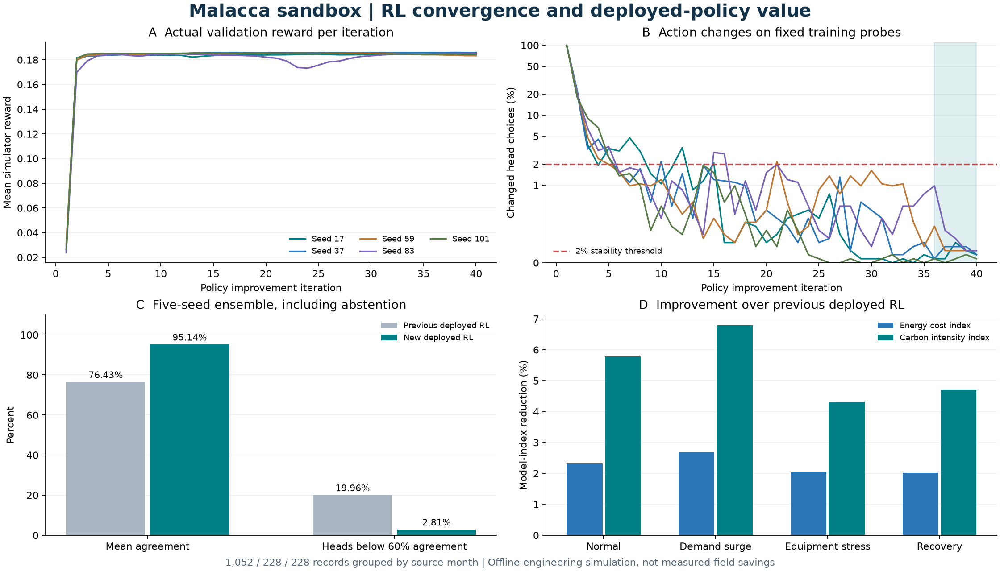

# 强化学习收敛修复与模型切换

本轮只优化强化学习业务决策。控制算法、旧的表格强化学习、单动作线性强化学习、监管增量策略及其历史证据均保留。当前十域联合业务主线使用 `factorized-fitted-policy-iteration`；它通过仿真交互回报学习价值函数和改进策略，没有使用专家动作标签，也没有以模型预测控制输出替代强化学习。



## 原因与实际修正

- 数据分区：旧业务数据集把同一公开月度锚点生成的四条情景记录按行切分，2016 年 12 月及 2021 年 9 月分别跨入相邻分区。新增整月分组协议，分为 1,052 条训练、228 条验证、228 条历史最终回归记录；旧报告不重写。
- 奖励归因：旧十域学习器把一个总奖励广播给所有动作头。新版从同一状态及同一外生记录出发，固定其他动作，比较一个动作头执行候选动作和保持动作的四步折扣回报，拟合该动作的边际价值。环境、奖励和动作业务系数保持原值。
- 更新波动：用冻结本轮策略、岭回归、0.15 阻尼更新替代新版策略的在线自举更新。保留旧两种学习器，实现独立增量训练路径。
- 收敛证据：每个种子运行 40 轮，保存回报拟合误差、验证奖励、参数幅度、固定训练探针上的动作变化和最终检查点。最后五轮动作变化须不超过 2%，验证奖励跨度不超过 0.003，并且参数有限；五个种子全通过才能晋级。这是经验稳定性，不能等同于全局最优证明。
- 运行评估：训练选择、最终回归和业务推理共用投票、低一致性回退、观测范围及联合吞吐准入；不再用单模型裸推理证明五模型运行效果。
- 数据质量：公开情景来源分数仍为 0.56，单独计算字段完整率；完整不代表实测、准确或有生产授权。
- 不确定性：四种固定情景分别报告完整时序结果，另做四个月为一块的冷启动回放、14 个时间块及 2,000 次配对自助重采样。相同月份的情景共用重采样索引；原始四情景正态区间仍保存在 `legacyAggregateGate`，不隐藏旧判据失败。

## 可复现训练

在仓库根目录执行，Node.js 24 或更新版本。每次使用新目录，防止覆盖已有训练和失败证据。

```bash
node --experimental-strip-types scripts/rl/trainCoreFittedCandidate.ts .runtime/core-fitted-reproduction-03
node --experimental-strip-types scripts/rl/finalizeCoreFittedCandidate.ts .runtime/core-fitted-reproduction-03
node --experimental-strip-types scripts/rl/buildCoreFittedEvidence.ts .runtime/core-fitted-reproduction-03 v3
```

第一步训练五个种子并完成验证。第二步要求全部种子收敛、分块及完整时序验证通过，随后以排他创建方式写入模型、数据和评估源码锁，最终历史回归只打开一次。第三步仅根据封存工件生成新版本报告，不重新读取测试结果调参。当前使用的 `v2` 报告已经生成；复现请使用新的版本号。

`reports/artifacts/core-operations-rl-v2/` 保存逐种子权重与曲线、验证和最终回归的完整配对明细、锁文件及未收敛试验。首轮高阻尼试验没有收敛，未进入冠军；被同月泄漏问题废弃的中途日志仍保留在 `.runtime/core-fitted-stable-01*`。

## 软件接口和切换

现有界面路径：**证据与闭环 → 策略闭环 → 生成十域联合计划 → 模拟双岗审批 → 执行联合沙盘计划并取回执**。页面展示当前模型和五个种子的训练稳定性；低一致性动作头会分别保持计划。快照更新后需重新生成并审批，不能沿用过时计划。

现有接口保持兼容：

- `GET /api/rl/core/status`：当前模型哈希、选择来源、回退原因及训练稳定性。
- `POST /api/rl/core/infer`：47 维观测、十域联合计划及业务投影；提案编号绑定模型哈希和输入快照。
- 现有提案审批、执行、回滚及报告接口：继续返回独立沙盘执行回执与配对反事实差值。
- `GET /api/operations/models`：实际活动模型，而不是固定的旧冠军名称。

本地模型切换与回退：

```bash
node --experimental-strip-types scripts/rl/switchCoreOperationsModel.ts reports/core-operations-rl-champion-v2.json
node --experimental-strip-types scripts/rl/switchCoreOperationsModel.ts reports/core-operations-rl-champion-v1.json
```

指针文件为 `reports/core-operations-active.json`。切换前检查协议、观测和动作顺序、参数维度与有限值、五种子及准入结果；原子替换指针，保存上一模型及切换回执。加载时校验模型文件、数据指纹和相关源码。当前模型损坏或源码不匹配时只可回到已钉住哈希的上一模型，二者都无效时关闭加载。`CORE_OPERATIONS_CHAMPION_REPORT` 显式指定的报告也必须校验。

## 现场数据接入

`PORT_BUSINESS_DATASET_PATH` 可替换训练数据文件，继续使用 `port-business-dataset.v3` 字段合同；实时输入继续通过 `terminal-operations.v2` 和现有运营方只读网关映射。模型切换能复用软件接口，现场模型效果不能靠换路径保证。

当前训练是新加坡月度汇总数据和工程情景，四步回报和四个月分块协议对应此采样尺度。运营方的分钟级数据必须另行确定样本时钟、容量单位、源事件分组、训练/验证隔离、预测提前量和现场收益计量，再校准环境并重训。当前月度协议不能直接用于几周分钟级数据，也不能把模型等待小时、等效队列或能源成本指数直接当现场小时、船数或现金。

现场落地仍需权威数据、设备及业务参数校准、只读影子运行、人工验收和正式授权。保持 `simulation_mode=true`、`live_data_verified=false`、`dispatch_allowed=false`、`production_authority=false`。强化学习负责业务可优化动作；主管机关放行与独立安全联锁定义可行动作边界。

方法参考：[近似策略迭代与线性价值学习](https://jmlr.csail.mit.edu/papers/volume4/temp/lagoudakis03a.pdf)、[强化学习的实证实验设计](https://jmlr.org/papers/v25/23-0183.html)、[强化学习可靠评估与分层重采样](https://github.com/google-research/rliable)。本实现是有模型的配对短期回报拟合，并不声称复现上述论文中的具体算法或理论保证。

## 本轮实际验收

99 项自动测试通过，类型检查与生产构建通过，强化学习、数据、监管、历史证据完整性和公开隐私检查通过。实际浏览器完成新模型推理、模拟双岗审批、执行、重复执行幂等性、报告导出和回滚。

执行报告见 `reports/core-operations-runtime-acceptance-v2.json`，回滚见 `reports/core-operations-runtime-rollback-v2.json`。配对沙盘回执 `core-receipt-b9b89c0244b20ed8` 记录新强化学习相对同状态继续原计划：等待减少 4.9 模型分钟，区间能耗减少 553.05 模型千瓦时，吞吐不变；这些不是现场计量结果。

完整 `pnpm release:check` 的依赖审计阶段发现原有开发依赖 browserslist 的两项高危公告（GHSA-c83g-rgw3-j3cx、GHSA-73wf-gq98-2v4g，修复版本为 4.28.7 或更新）。本轮强化学习检查已通过，但不能把整条发布门禁标记为通过；本轮没有发布到远端，也没有调整控制算法。
